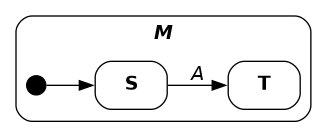
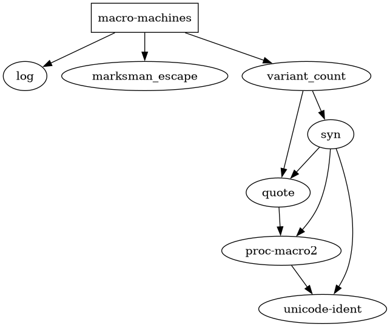

# `macro-machines`

> State machine macros with logging and graphviz dotfile generation

[Documentation](https://docs.rs/macro-machines)


**Current features**

- Macros for creating state machines with and without `Debug` and `Default`:
    * `def_machine!` -- state machine implementing `Default` construction
    * `def_machine_debug!` -- state machine implementing `Default` construction
      and deriving `Debug`
    * `def_machine_nodefault!` -- state machine requiring initialization
      arguments
    * `def_machine_nodefault_debug!` -- state machine requiring initialization
      arguments and deriving `Debug`
- Specified initial (required) and terminal (optional) states with (optional)
  initialization and termination actions
- States may have local state variables and state machines may have
  extended state variables
- Events with optional associated parameters and actions in which extended state
  variables may be modified:
    * External events -- transition from a specific source state to a specific
      target state
    * Internal events -- an event that is additionally allowed to modify local
      state variables and leaves the current state unchanged
    * Universal events -- transition from any source state to a specific target
      state
- Syntax allowing use of constrained type parameters in the types of extended
  state variables
- Logging using the `log` logging API
- Graphviz DOT file generation of state machine transition diagrams


**Current limitations**

- Only trace-level messages are currently logged


## Usage

The macros provided by this library expand to definitions using `const fn`s and
some intrinsics to help generate dotfiles, so these features must be enabled in
the crate root:

```rust
#![feature(const_fn)]
#![feature(core_intrinsics)]
```

Define and use a minimal state machine:

```rust
use macro_machines::def_machine_debug;
def_machine_debug!{
  machine M {
    STATES [
      state S ()
      state T ()
    ]
    EVENTS [
      event A <S> => <T> ()
    ]
    EXTENDED []
    initial_state: S
  }
}

fn main () {
  use macro_machines::HandleEventException;

  let mut m = M::initial();
  let e = Event::from_id (EventId::A);
  m.handle_event (e).unwrap();
  let e = Event::from_id (EventId::A);
  assert_eq!(m.handle_event (e), Err (HandleEventException::WrongState));
}
```

Generate a dotfile and write to file:

```rust
  use std::io::Write;
  use macro_machines::MachineDotfile;
  let mut f = std::fs::File::create ("minimal.dot").unwrap();
  f.write_all (M::dotfile().as_bytes()).unwrap();
  drop (f);
```

Rendered as PNG with `$ dot -Tpng minimal.dot > minimal.png`:



For examples of more complex state machines, see the `./examples/` directory.


## Dependencies


